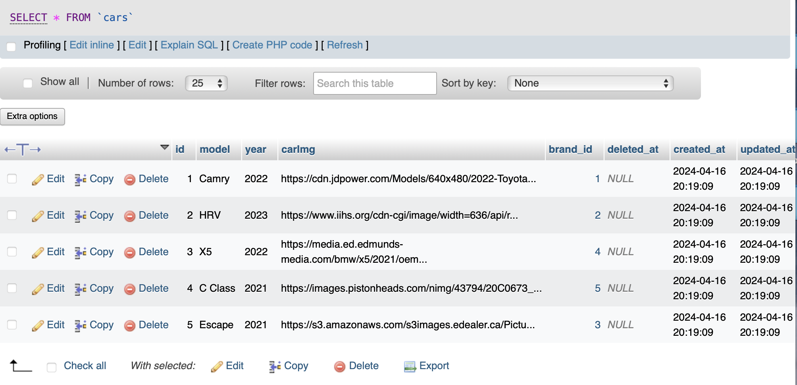
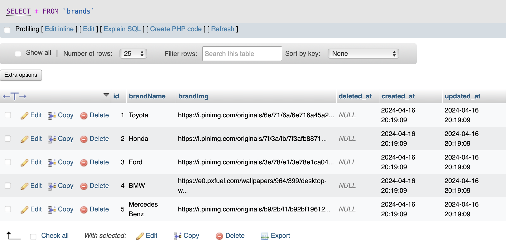
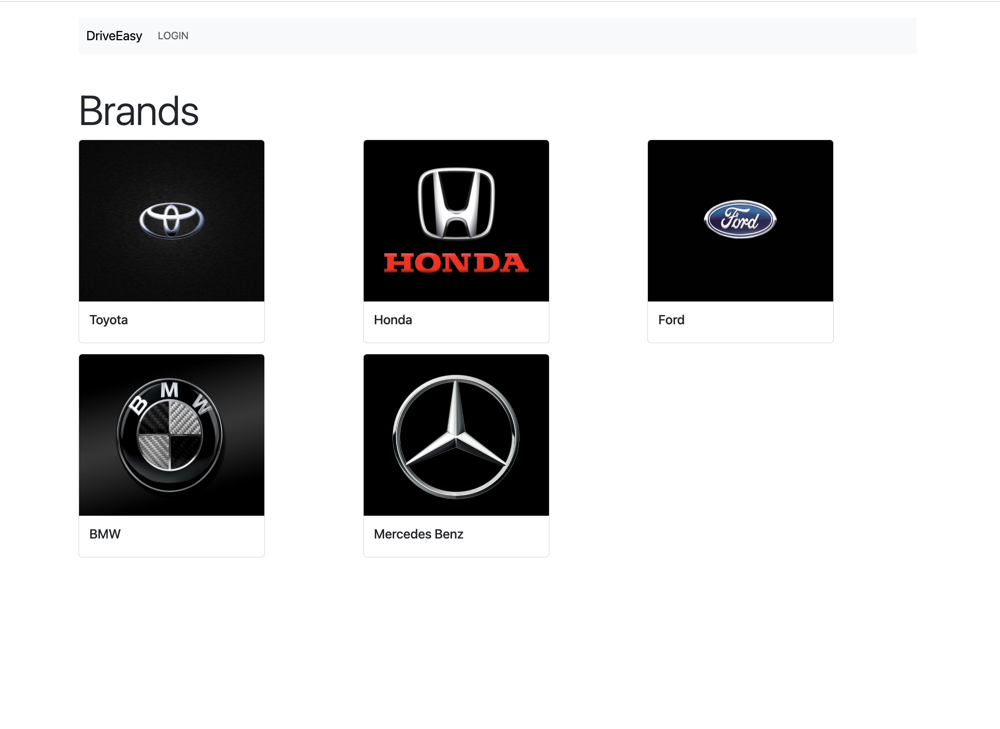
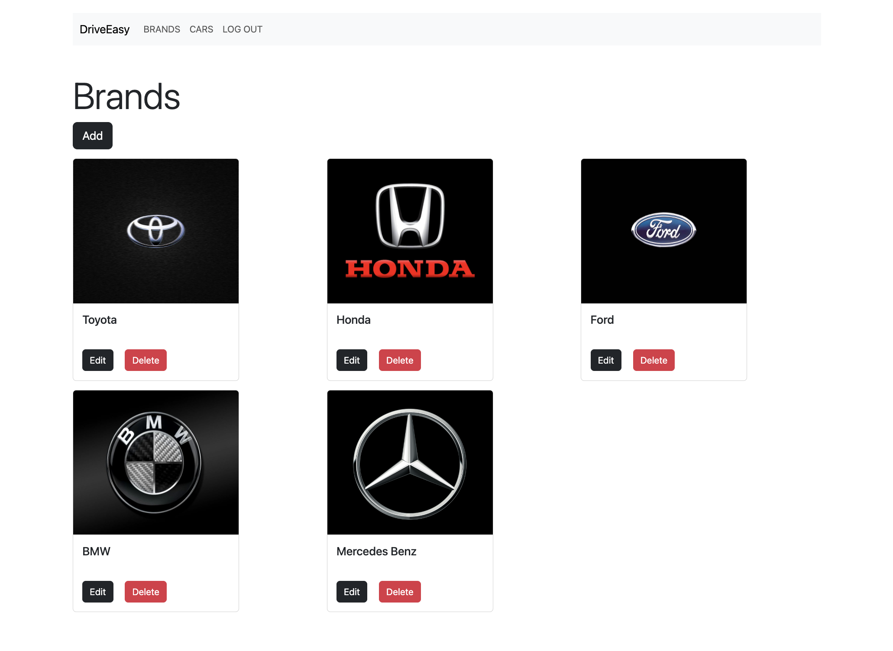
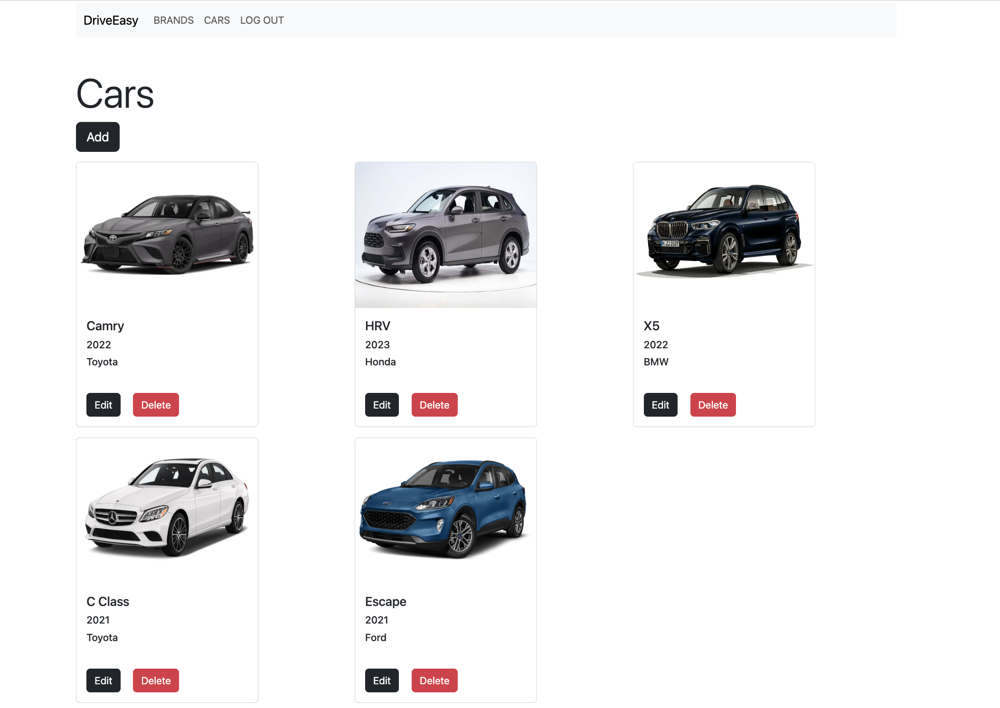

# DriveEasy

## About DriveEasy

DriveEasy is a CMS system demonstrating a model of an online 'Car Rental' platform. The website consists of different cars and brands.

## Introduction
This repository contains a comprehensive Content Management System (CMS) built using Laravel in PHP, demonstrating an online car rentals website. The CMS allows users to perform CRUD (Create, Read, Update, Delete) operations on two main entities: Cars and Brands. It leverages Laravel for the backend functionalities and Bootstrap for the frontend design.

## Features
- **User Authentication**: Admin users can securely log in to the system.
- **CRUD Operations**: Admin users can perform CRUD operations on both cars and brands entities.
- **Relationships**: There is a one-to-many relationship between brands and cars, where each brand can have multiple cars associated with it.
- **Responsive Design**: The frontend is built using Bootstrap, ensuring compatibility with various devices and screen sizes.

## Entities

### Cars
- **Attributes**:
  - `id`: Unique identifier for the car.
  - `model`: Model of the car.
  - `year`: Manufacturing year of the car.
  - `carImg`: Image for the car.
  - `brand_id`: Foreign key referencing the brand the car belongs to.
  

- **Operations**:
  - Create: Add a new car to the system.
  - Read: View details of existing cars.
  - Update: Modify information of existing cars.
  - Delete: Remove cars from the system.
 

### Brands
- **Attributes**:
  - `id`: Unique identifier for the brand.
  - `brandName`: Name of the brand.
  - `brandImg`: Country of origin of the brand.
    
- **Operations**:
  - Create: Add a new brand to the system.
  - Read: View details of existing brands.
  - Update: Modify information of existing brands.
  - Delete: Remove brands from the system.

## Screenshots
### Login Page

### Brands Page

### Cars Page

## Setup Instructions
1. Clone the repository to your local machine.
2. cd your_repository
3. composer install
4. Configure your database settings in the `.env` file. (check env-sample)
5. Run migrations to create the necessary tables in the database - php artisan migrate:refresh --seed
6. Serve the application - php artisan serve

## Usage
1. Open your web browser and navigate to `http://localhost:8000`.
2. Log in using your admin credentials.
3. Explore the available functionalities on the Cars and Brands pages.
4. Perform CRUD operations as needed.

## Contributors
- [Sravani Singani](https://github.com/SravaniSingani)

